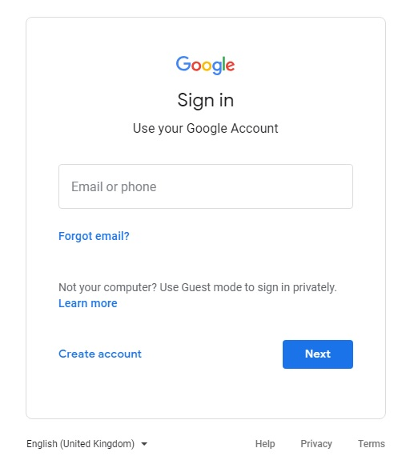
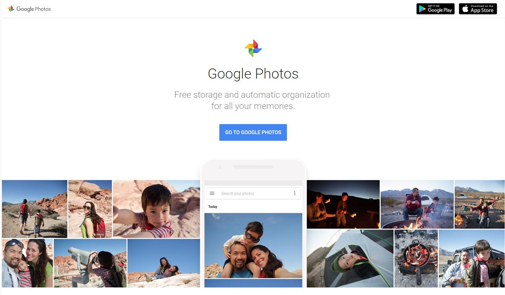
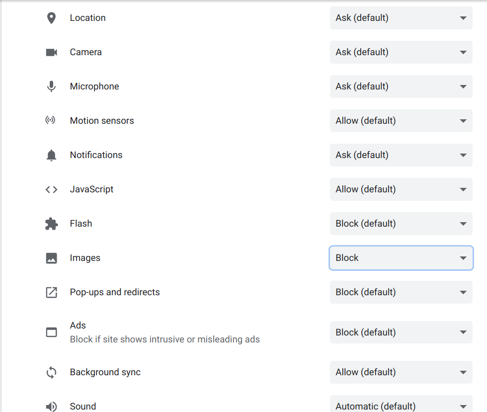
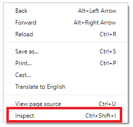
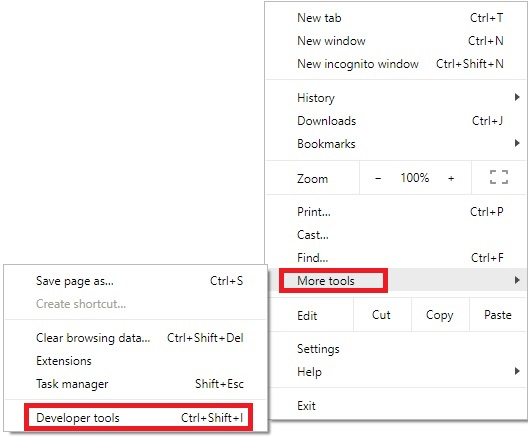
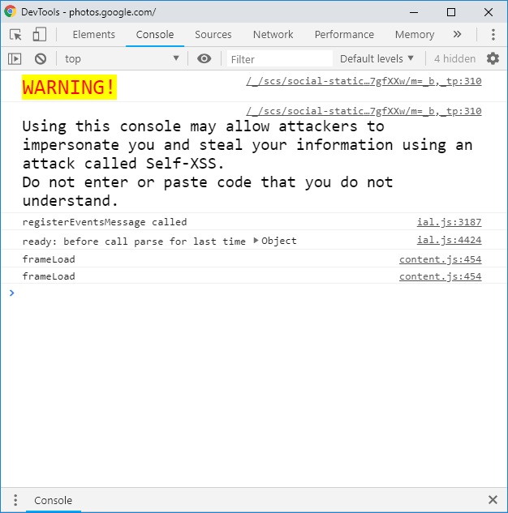
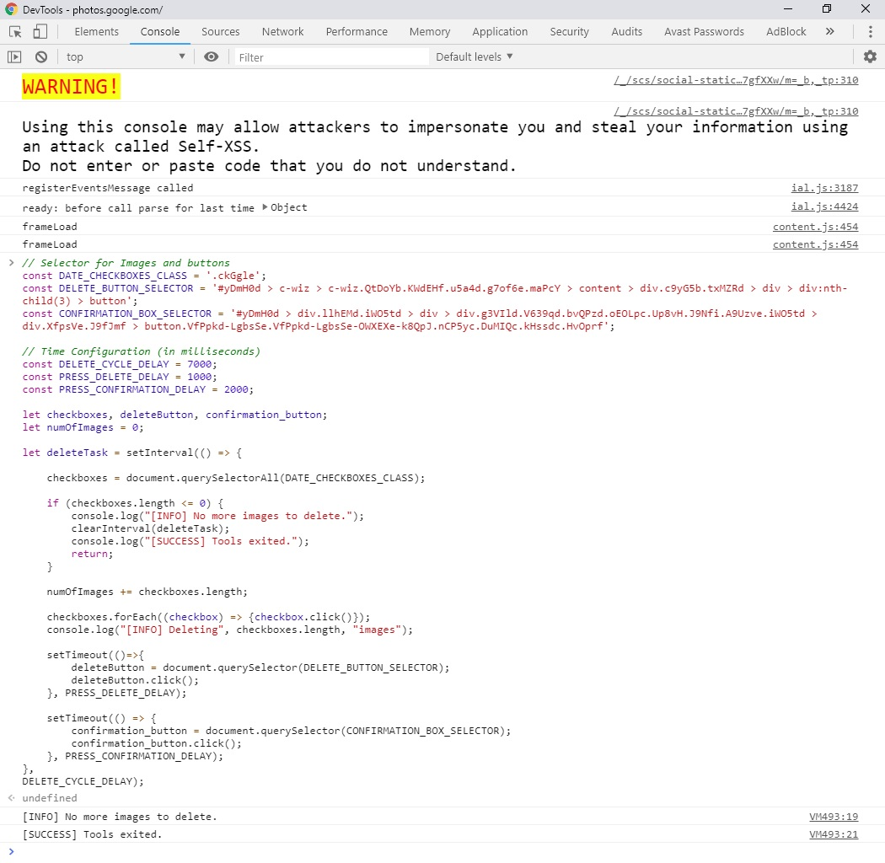

# Google Photos Delete All Tool
If you have ever wanted to delete your thousands of photos from the [Google Photos](https://photos.google.com/) but failed to find an easy way to do so, then this is the tool for you. This script goes through all your photos in Google Photos app on the desktop and deletes them. You can visually see the process while it happens!

# Getting Started
Follow the step-by-step instructions below to run the tool.

## Prerequisites
- A fairly recent version of a modern web browser. This script has not been tested with any browser other than Google Chrome `Version 71.0.3578.98`. You can [download the latest version of the Google Chrome browser here](https://www.google.com/chrome/). However, you can still use it with any modern browser, like, [Firefox](https://www.mozilla.org/en-US/firefox/download/thanks/) or [IE Edge](https://www.microsoft.com/en-ca/windows/microsoft-edge).

- Use the [english language version of Google Photos](https://photos.google.com/?hl=en).

## Assumptions
The manual steps assume that these steps are performed on the Google Chrome Browser. If you're using a different browser, the steps still remain the same, however, the keyboard shortcuts or browser specific keywords may not be same for you, as described below.

## Steps
1) [Login into your Google Account](https://accounts.google.com/ServiceLogin).

2) Go to [Google Photos](https://photos.google.com/?hl=en)

_Note: If you're logged into Google, you will see your images._
_Note: You must login into English language version of Google Photo_

3) Disable image loading for Google Photos on your browser to avoid high cpu,ram and network usage

   - **On Chrome**

      1) Click on the site padlock ( the lock icon along the url bar) -> Site settings

      2) Block images in the Permissions for the website

     

      3) Reload Google Photos

4) Open Developer Tools. You can do so by following either of the three options

   - **Keyboard Shortcut**

     Press the three keys together in the sequence - `CTRL + SHIFT + I`

   - **From the Page**

     Right click on an empty area with your mouse and select `Inspect` (last option)

     

   - **From Menu**

      1) Click on the menu button  on Google Chrome (By default, the button is present on the top right corner of the window).

      2) Select `More tools`.

      3) Select `Developer tools`.

     

5) After opening the developer tools, click on the `Console` tab.
   

   Note: _This console lets you run custom code, like this tool! You can learn about it on [Google Console page](https://developers.google.com/web/tools/chrome-devtools/console/)_.

   *You will see a warning from Google to stay cautious. If you run code in this console that's malicious, you could be hacked. Therefore, make sure that you only run the code that you understand.*

6) Copy all the code in the file [delete_photos.js](delete_photos.js) and paste it in the console.
   

   Note: The script allows you to delete all photos or any number of photos. To delete a specific number of photos, change the value of `maxImageCount` as provided in the [example](delete_photos.js#L3).

7) Hit **ENTER** button after pasting the script in the console. The script will start running upon hitting ENTER key.

8) Done! Now, you should see the script delete all your photos in the batch

# Go Faster Option

Script selects and deletes photos in batches based on what can be seen in the browser at one time. To increase the amount of photos that can be seen at once, and therefore deleted per batch, zoom out.

    - **Chrome on Windows and Linux**

        Control-Minus to zoom out.

    - **Chrome on Mac**

        Command-Minus to zoom out.

# Debugging

The script may not work as expected in case your internet speed is considerably slow. In that case, you may want to increase the `DELETE_DELAY_CYCLE` by few thousands of milliseconds. This is to ensure that the page has refreshed before the tool tries to delete the images again.

# FAQs

1) It checks and unchecks the photos, but doesn't delete them.
   - Use the [english language version of Google Photos](https://photos.google.com/?hl=en) and run the tool again.

2) It stops after deleting some images.
   - Increase the `DELETE_DELAY_CYCLE` by thousands of milliseconds as described in the [Debugging section](#Debugging).

3) There was a delay in loading images and the tool exited.
    - In case this happens, you can simply paste the script again and hit enter. The script will continue doing the operation.
    If you're using, you wouldn't have to copy and paste again. If you press the up arrow key, it will load the last command that you ran in the console. Hit ENTER key and the script will start again.
